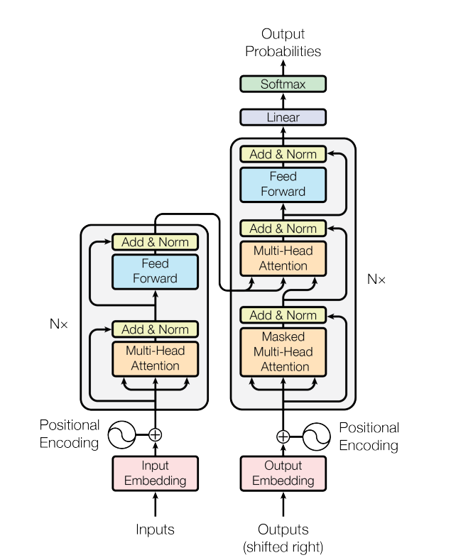

# Background and Motivation

### Background

> + RNNs have been firmly established as state of the art approaches in sequence modeling and transduction problem such as language modeling and machine translation.
>
> + RNN precludes parallelization within training examples.
> + Attention Mechanisms allow modeling of dependencies without regard to distances in the input or output sequences. However, attention mechanisms are used in conjunction with a recurrent network.

### Motivation

> + Propose the **Transformer**, a model architecture eschewing recurrence and instead relying on attention mechanism to draw global dependencies between input and output.
>
> + **Transformer** allows for significantly more parallelization and can reach a new state of the art in translation quality.

# Model Architecture

The **Transformer** follows an encoder-decoder architecture, which encodes an input sequence $x=(x_1, x_2, ..., x_n)$ to a sequence of continuous representation $z=(z_1, z_2, ..., z_n)$  and generates an output sequence $(y_1, y_2, ..., y_m)$  of symbols one element at a time.

# Pytorch Implementation
